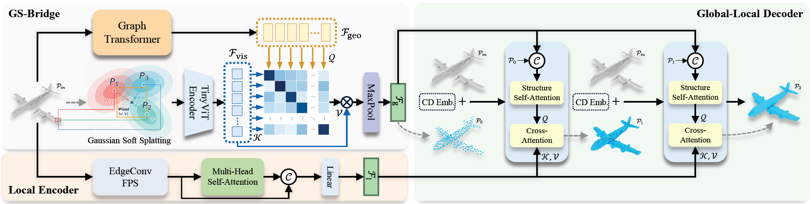

<p align="center">
  
</p>

# SplAttN: Bridging 2D and 3D with Gaussian Soft Splatting and Attention for Point Cloud Completion

<p align="center">
  <a href="https://arxiv.org/abs/2605.01466"></a>
  <a href="https://github.com/zay002/SplAttN-Public"></a>
  <a href="LICENSE"></a>
  
</p>

<p align="center">
  <strong>ICML 2026 Spotlight</strong>
</p>

<p align="center">
  Zhaoyang Li, Zhichao You, Tianrui Li
</p>

<p align="center">
  <a href="https://arxiv.org/abs/2605.01466">Paper</a> |
  <a href="https://drive.google.com/drive/folders/1eveJZJNVdZEcpof2TuKfSiY9luMTXOWz?usp=sharing">Pretrained Models</a>
</p>

<p align="center">
  
</p>

Official PyTorch implementation of **SplAttN**, accepted to **ICML 2026** as a **Spotlight** paper.

## 📌 Abstract

Although multi-modal learning has advanced point cloud completion, the theoretical mechanisms remain unclear. Recent works attribute success to the connection between modalities, yet we identify that standard hard projection severs this connection: projecting a sparse point cloud onto the image plane yields an extremely sparse support, which hinders visual prior propagation, a failure mode we term Cross-Modal Entropy Collapse. To address this practical limitation, we propose SplAttN, which replaces hard projection with Differentiable Gaussian Splatting to produce a dense, continuous image-plane representation. By reformulating projection as continuous density estimation, SplAttN avoids collapsed sparse support, facilitates gradient flow, and improves cross-modal connection learnability. Extensive experiments show that SplAttN achieves state-of-the-art performance on PCN and ShapeNet-55/34. Crucially, we utilize the real-world KITTI benchmark as a stress test for multi-modal reliance. Counter-factual evaluation reveals that while baselines degenerate into unimodal template retrievers insensitive to visual removal, SplAttN maintains a robust dependency on visual cues, validating that our method establishes an effective cross-modal connection.

## 🔥 News

- **2026.05.05**: The arXiv paper link and citation have been updated.
- **2026.04.30**: SplAttN has been accepted to **ICML 2026** and selected as a **Spotlight** paper.
- Code and pretrained checkpoints are released. Additional project materials will be updated in this repository.

## ✨ Highlights

- We identify **Cross-Modal Entropy Collapse**, a sparse-support failure mode caused by hard 2D projection.
- We introduce **Differentiable Gaussian Splatting** to form dense, continuous image-plane representations from sparse 3D observations.
- SplAttN improves cross-modal connection learnability and achieves state-of-the-art performance on **PCN** and **ShapeNet-55/34**.
- Counterfactual evaluation on **KITTI** shows stronger reliance on visual cues than prior multi-modal baselines.

## 🧠 Method Overview

SplAttN is designed for image-guided point cloud completion. The core idea is to maintain a learnable and differentiable connection between sparse 3D geometry and 2D visual priors.

- **Differentiable Gaussian Splatting** converts sparse projected points into a dense image-plane representation.
- **Attention-based fusion** learns cross-modal dependencies between geometric features and visual features.
- **Counterfactual evaluation** measures whether a model genuinely relies on visual cues instead of treating images as incidental inputs.

## 🛠️ Installation

### Requirements

- Python >= 3.8
- PyTorch >= 1.8.0
- CUDA >= 11.1

Key Python dependencies include:

- `torchvision`
- `timm`
- `open3d`
- `h5py`
- `opencv-python`
- `easydict`
- `transforms3d`
- `tensorboardX`

### CUDA Extensions

Install PointNet++ operations, KNN_CUDA, and Chamfer Distance:

```bash
cd pointnet2_ops_lib
python setup.py install --user

cd ../KNN_CUDA
python setup.py install --user

cd ../metrics/CD/chamfer3D
python setup.py install --user
```

## 📂 Datasets

Download the PCN and ShapeNet-55/34 datasets, then update the dataset paths in the corresponding configuration files.

- [PCN](https://gateway.infinitescript.com/s/ShapeNetCompletion)
- [ShapeNet-55/34](https://github.com/yuxumin/PoinTr)

Example configuration:

```python
# PCN dataset (config_pcn.py)
__C.DATASETS.SHAPENET.PARTIAL_POINTS_PATH = 'data/PCN/%s/partial/%s/%s/%02d.pcd'
__C.DATASETS.SHAPENET.COMPLETE_POINTS_PATH = 'data/PCN/%s/complete/%s/%s.pcd'

# ShapeNet-55 dataset (config_55.py)
__C.DATASETS.SHAPENET55.COMPLETE_POINTS_PATH = 'data/ShapeNet55-34/shapenet_pc/%s'

# ShapeNet-34 / Unseen-21 split
__C.DATASETS.SHAPENET55.CATEGORY_FILE_PATH = 'datasets/ShapeNet34'
# or
__C.DATASETS.SHAPENET55.CATEGORY_FILE_PATH = 'datasets/ShapeNet-Unseen21'
```

## 📦 Pretrained Models

Pretrained checkpoints for PCN, ShapeNet-55, and ShapeNet-34 are available on [Google Drive](https://drive.google.com/drive/folders/1eveJZJNVdZEcpof2TuKfSiY9luMTXOWz?usp=sharing).

The pretrained TinyViT backbone can be downloaded from the [TinyViT repository](https://github.com/wkcn/TinyViT).

## 🚀 Evaluation

Set the checkpoint path in the corresponding configuration file before evaluation:

```python
__C.CONST.WEIGHTS = "path/to/checkpoint.pth"
```

Run evaluation:

```bash
# Single-GPU evaluation
python main_pcn.py --test
python main_55.py --test
python main_34.py --test

# Distributed evaluation
CUDA_VISIBLE_DEVICES=0 python -m torch.distributed.launch \
  --master_port=13222 \
  --nproc_per_node=1 \
  main_pcn.py --test
```

## 🏋️ Training

```bash
# Single-GPU training
python main_pcn.py
python main_55.py
python main_34.py

# Multi-GPU distributed training
CUDA_VISIBLE_DEVICES=0,1,2,3 python -m torch.distributed.launch \
  --master_port=13222 \
  --nproc_per_node=4 \
  main_pcn.py

CUDA_VISIBLE_DEVICES=0,1,2,3 python -m torch.distributed.launch \
  --master_port=13222 \
  --nproc_per_node=4 \
  main_55.py

CUDA_VISIBLE_DEVICES=0,1,2,3 python -m torch.distributed.launch \
  --master_port=13222 \
  --nproc_per_node=4 \
  main_34.py
```

## 📖 Citation

If you find this work useful, please cite:

```bibtex
@misc{li2026splattnbridging2d3d,
      title={SplAttN: Bridging 2D and 3D with Gaussian Soft Splatting and Attention for Point Cloud Completion}, 
      author={Zhaoyang Li and Zhichao You and Tianrui Li},
      year={2026},
      eprint={2605.01466},
      archivePrefix={arXiv},
      primaryClass={cs.CV},
      url={https://arxiv.org/abs/2605.01466}, 
}
```

## 🙏 Acknowledgements

This repository builds upon several excellent open-source projects:

- [PoinTr](https://github.com/yuxumin/PoinTr)
- [SnowflakeNet](https://github.com/AllenXiangX/SnowflakeNet)
- [AnchorFormer](https://github.com/chenzhik/AnchorFormer)
- [SVDFormer](https://github.com/czvvd/SVDFormer_PointSea)
- [SeedFormer](https://github.com/hrzhou2/seedformer)
- [GRNet](https://github.com/hzxie/GRNet)
- [GeoFormer](https://github.com/Jinpeng-Yu/GeoFormer)

We use [Mitsuba 3](https://github.com/mitsuba-renderer/mitsuba3) to visualize point cloud completion results.
